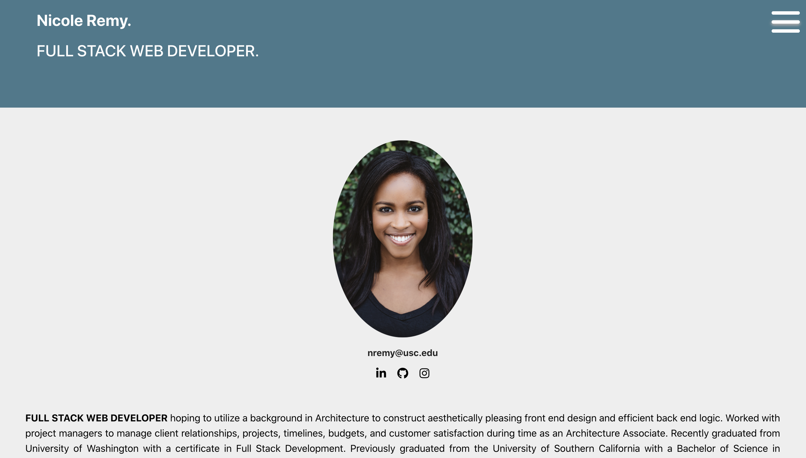
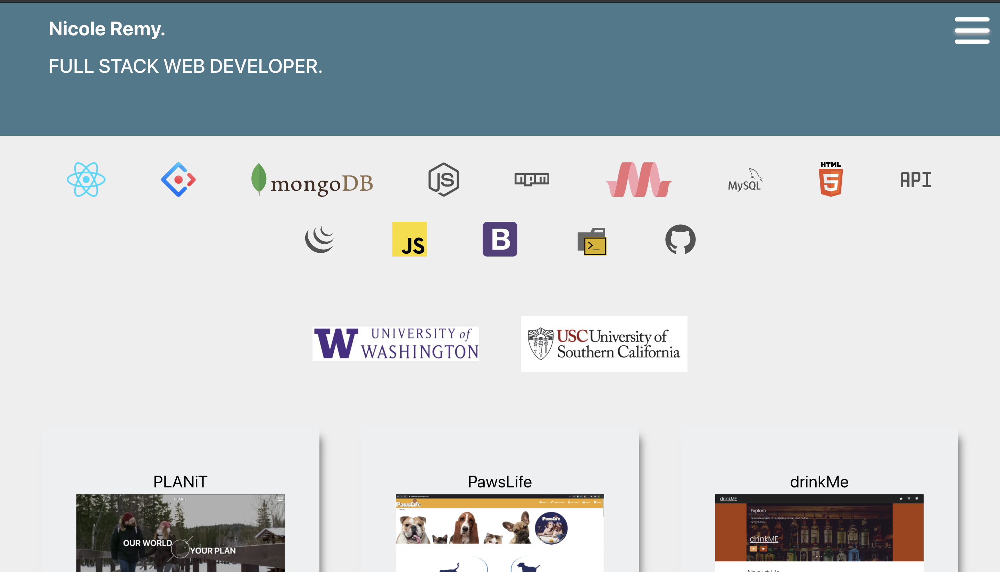

# portfolio
Welcome to my professional portfolio!

### Link to Deployed Application
1. [Nicole](https://ner-portfolio.herokuapp.com/)

### Description
This application is a portfolio of my work as a web developer. My portfolio includes a section about me and some highlighted projects. 

This application is deployed to Heroku. If you go to the deployed site, you can click the app install to install the application to your computer. 

    
## Table of Contents
1. [Installation](#installation)
2. [Usage](#usage)
3. [License](#license)
4. [Contributing](#contributing)
5. [Tests](#tests)
6. [Questions](#questions)

### Images of App
#### Home Screen

### App

### Installation
In terminal, please make sure to npm init -y and npm i to import all dependencies. Test offline by going into your dev tools, Network, and then offline.  

### Usage
This application is my personal professional portfolio. 

### License 

This application is covered under MIT.

### Contributing 
Pull requests are welcome. For major changes, please open an issue first to discuss what you would like to change.

### Tests
Please make sure to update tests as appropriate.

### Questions
1. [Github](https://github.com/nicoleremy95/competitive-portfolio)

    
     
